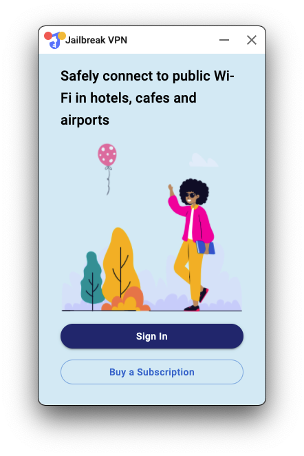

# React Electron VPN

<p align="center">
  
</p>
<br>

<p>
  Builded From Electron React Boilerplate uses <a href="https://electron.atom.io/">Electron</a>, <a href="https://facebook.github.io/react/">React</a>, <a href="https://github.com/reactjs/react-router">React Router</a>, <a href="https://webpack.js.org/">Webpack</a> and <a href="https://www.npmjs.com/package/react-refresh">React Fast Refresh</a>.
</p>

<br>

</div>

## Install

Clone the repo and install dependencies:

```bash
git clone -b main https://github.com/inozura/retron-vpn
cd retron-vpn
npm install
```

**Having issues installing? See our [debugging guide](https://github.com/electron-react-boilerplate/electron-react-boilerplate/issues/400)**

## Starting Development

Start the app in the `dev` environment:

```bash
npm start
```

## Packaging for Production

To package apps for the local platform:

```bash
npm run package
```

## Docs

See [docs here](https://electron-react-boilerplate.js.org/docs/installation)
